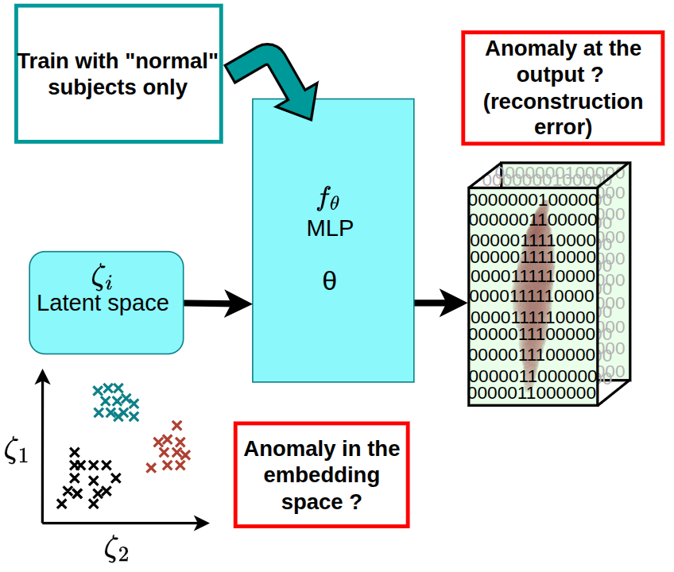
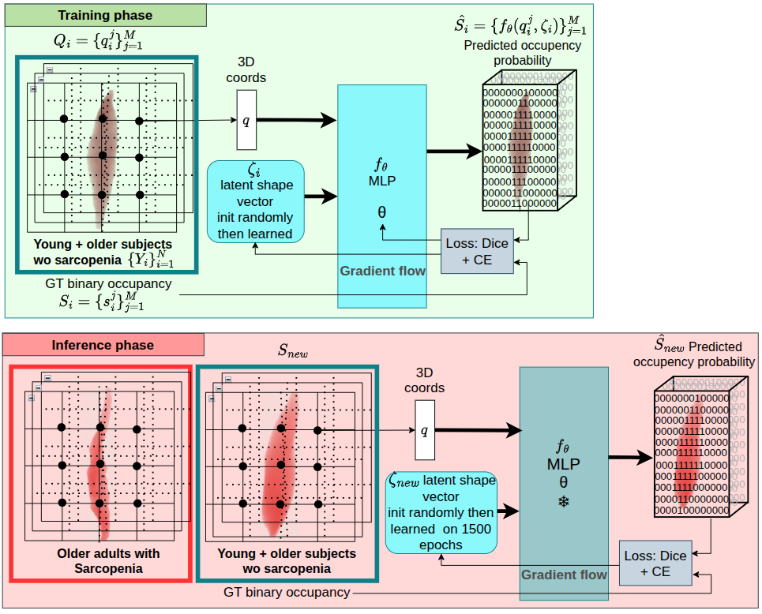
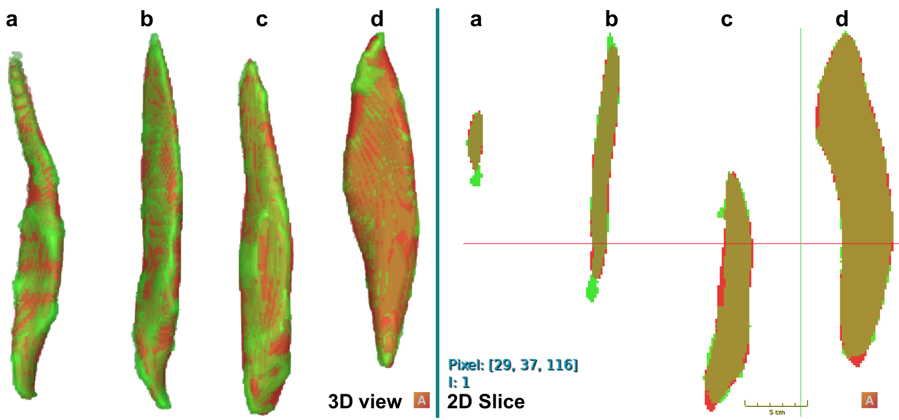
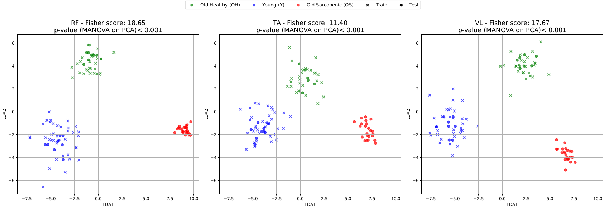
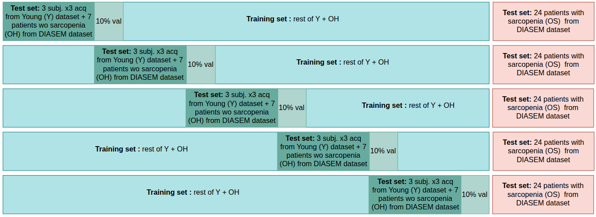

# Unsupervise anomaly detection using INR (Unsupervise_anomaly_INR)

## Description  
This repository contains the code associated with the work described in the article :
L. Piecuch, J. Huet, A. Frouin, A. Nordez, A. -S. Boureau and D. Mateus, "Unsupervised Anomaly Detection on Implicit Shape Representations for Sarcopenia Detection," 2025 IEEE 22nd International Symposium on Biomedical Imaging (ISBI), Houston, TX, USA, 2025, pp. 1-5, doi: 10.1109/ISBI60581.2025.10980714

**Sarcopenia** is a muscle condition frequent with age that impacts quality of life and is characterized by strength impairment. Traditional assessment relies on whole muscle mass estimation or 3D imaging and segmentations for muscle volume.  

This project analyzes **muscle shape** using an **implicit neural representation (INR)**. The method:  

- Models normal muscle shapes  
- Uses **unsupervised anomaly detection** to identify sarcopenic muscles from reconstruction errors  
- Learns a **latent representation** that separates normal and abnormal muscles directly from the associated labels  

Experiments on **103 segmented volumes** show that muscle shape is sensitive to aging and sarcopenia. This method provides both **quantitative metrics** and **qualitative visualizations** of muscle shape impairments.

> **Clinical relevance:** This tool allows researchers and clinicians to characterize muscle structure deformation, directly from manual segmentation (from any modality, here the segmentation were created from 3D Ultrasound images), facilitating large-scale studies.  


---
## Table of Contents

1. [Architecture](#architecture)  
2. [Results](#results)  
   - [Qualitative](#qualitative-results)  
   - [Quantitative](#quantitative-results)  
3. [Installation](#requirements--installation)  
4. [Data](#data)  
5. [Usage](#usage)  
6. [References](#references)  

---
## Architecture

The model uses a **conditional INR with an auto-decoding strategy** to encode muscle shapes into a latent space and reconstruct them. Anomalies are detected based on reconstruction errors.  

  
*Figure: Overview of the INR model for muscle shape modeling.*  

---

## Results

### Qualitative Results

Example segmentation reconstructions highlighting normal vs. sarcopenic muscles:  

  
*Figure: Qualitative results. Muscles from older adults with (a) and without (b) sarcopenia vs. from young subjects (c and d). Superposition of the GT (in green) and the prediction (in red)*  
> These overlays show how the model reconstructs muscle shapes. Larger reconstruction errors indicate abnormal shape.  

Example of visualization of the first 2 LDA components applied to the latent space of each subject. 
 
*Figure: Visualization of the first two LDA components applied to the INR’s latent representation of train and test participants for each muscle. 
Blue is for Y, dark green for OH and red for OS. A Fisher score and its corresponding p-value is calculated for each muscle.*

### Quantitative Results
Example of boxplots of Dice metric you can obtain for the 5 fold cross-validation for the 2 tests sets: Nomal shape (Y + OH) and Sarcopenic shape (OS) :
  
*Figure: Box plot of Dice scores, from test predictions of healthy (Y+OH) and sarcopenic (OS) participants obtained with an INR model trained on healthy subjects, for the RF on different folds. The Dice score quantifies the volumetric overlap between the original segmented volume (manual ground truth) and the INR’s labelmap prediction. For each fold, healthy (Y+OH) adults were separated into train and test groups. OS were always in the test group. The p-value represents the overall effect of the OS group on Dice score, regardless of the fold.*

## Requirements & Installation  

### Prerequisites  

- Python 3.10.10 or higher  
- Common Python libraries for medical image processing: e.g. `numpy`, `scipy`, `nibabel`, `pandas`, `matplotlib`, possibly `torch` / `tensorflow` (depending on implementation)
- all the required libraries are in requirement.txt
- Optionally but recommanded: a CUDA-enabled GPU
  
### Install  

```bash
git clone https://github.com/piel3203/Unsupervise_anomaly_INR.git 
cd <Unsupervise_anomaly_INR>  
python -m venv venv  
source venv/bin/activate    # or `venv\Scripts\activate` on Windows  
pip install -r requirements.txt  
```

## Data 
The code requires **3D segmented muscle volumes** (no images other than the segmented labelmaps needed) for each subject. The code can also work on sparsen slices, but to capture the full shape differences we decided to use all the slices provided for the train and inference. A tradeoff can be done to manage the memory if needed by reducing the number of slices given as input. The segmentation labelmaps should be binary. If this is not the case, Please use the code ./ ... to binarize your labelmap if needed. 

- **Format**: 3D NIfTI files (.nii or .nii.gz) with integer labels for each muscle. Data can be directly converted from nrrd files with the small code provided in ... 

- **Subjects**: "Normal" (Y + OH) or Sarcopenic (OS).

- **Usage**: Place your volumes in the ./data folder. If you have multiple labelmaps for difference muscles, use this path architecture: ./data/muscle_name/labels . Filenames should be consistent with the subject IDs.

**Note**: The original clinical dataset is not publicly available. Use your own segmentations or request access from the corresponding institution.

Example of 5-fold cross-validation applied on our datasets:

  
*Figure: Dataset separation for the creation of the 5 folds for the cross-validation.*

## Usage 
### 1. Prepare the Data

After placing your data inside the `./data` directory, you must create **casename files** that specify which subjects belong to the training and testing sets. For the testing set, we advice you to separate the sarcopenic subjects from the `Normal` (Y + OH) ones to ensures compatibility with the downstream analysis scripts provided in the repository./output. 

For a single experiment, create three files:

- `train_cases_1.txt`
- `test_cases_1.txt`
- `sarcopenia_subj.txt`

For **5-fold cross-validation**, extend this to:

- `train_cases_1.txt` … `train_cases_5.txt`
- `test_cases_1.txt` … `test_cases_5.txt`
- - `sarcopenia_subj.txt`

⚠️ **Important:**  
Make sure each subject appears **only in the train OR test file** within the same fold to avoid data leakage.

An example of casename files is available in: ./casename_files/RF

---

### 2. Optional Pre-processing

If needed, a preprocessing step can be applied to your data:

- Re-centering the muscle volumes on their barycenter  
- Optional flipping along a chosen axis  

Example preprocessing scripts can be found in: ./preprocessing/ 


---

### 3. Training

Before training, configure the file paths and training parameters.

#### 3.1 Path Configuration

Edit `paths_config_default.yml` to specify:

- **model_basedir**: directory where trained models are saved/loaded  
- **data_basedir**: root folder containing your dataset (e.g., `./data`)  
- **labels_dirname**: subdirectory containing the segmentation labels  
  - Example:  
    - `data_basedir: ./data`  
    - `labels_dirname: ./RF`  
    - → dataset path becomes `./data/RF`
- **output_basedir**: directory for saving reconstructions and predictions  

---

#### 3.2 Training Configuration

Edit `train_config_default.yml` with the following key parameters:

- **train_casefile**: the training casename file you created  
- **model_name**: name of the model to train  
  - Change this to train a new model (safety checks prevent overwriting old ones)  
- **task_type: 0**  
  - Must stay at `0` (unsupervised anomaly detection with Autodecoder)
- **val_fraction: 0.1**  
  - Fraction of training data used for validation (recommended: 10%)
- **slice_step_size: 1**  
  - Uses all slices of each segmentation volume  
- **slice_step_axis: 2**  
  - Axis for slice thinning: 0 = sagittal, 1 = coronal, 2 = axial  
- **num_points_per_example_per_dim_train: -1**  
  - Uses the whole 3D volume (recommended)  
  - Reduce only if GPU memory is limited

Other parameters define the network structure, optimizer, and number of epochs.  
An example configuration file is provided in the repository.

---

### 3.3 Launch Training

Once everything is configured, run the training script:

```bash
CUDA_VISIBLE_DEVICES=0,1 python train.py -p ./paths_config_default.yml -c ./train_config_default.yml
```
Remove CUDA_VISIBLE_DEVICES=0,1 if you do not have a GPU
Adjust GPU indices to match your hardware (e.g., CUDA_VISIBLE_DEVICES=0)

## 4. Inference

Once the model has been trained, you can run inference to generate **predictions** and extract the **latent vectors** for the test subjects.  
Inference should be performed on:

1. A **normal test set** (Y + OH) to verify that the method behaves correctly on healthy shapes  
2. A **sarcopenic test set** (OS) to evaluate anomaly detection performance  

**Recommendation:**  
Run two separate inference passes using both:
- `test_cases_1.txt`
- `sarcopenia_subj.txt`

This ensures compatibility with the downstream analysis scripts provided in the repository./output.

Before launching inference, configure the file `eval_config_default.yml` as described below.

---

### 4.1. Inference Configuration

Edit `eval_config_default.yml` with the following key fields:

- **test_casefile**  
  Path to the casename file listing the test subjects.

- **evaluate_predictions: True**  
  Enables computation of the quantitative metrics described in the paper:  
  - Dice (DSC)  
  - Hausdorff distance (HSD)  
  - HSD95  
  - Volumetric error (cm³ and %)  

- **export_predictions: True**  
  Saves qualitative results (labelmap reconstructions, overlays, etc.).

- **allow_overwriting: False**  
  Prevents accidental overwriting of previous predictions.  
  Set to `True` only if you intend to replace existing results.

---

### 4.2. Slice-Based Evaluation Settings

- **sample_orthogonal_slices: False**  
  Do *not* use orthogonal slice sampling.  
  For shape anomaly detection, we recommend using the full volume.

- **slice_step_size: 1**  
  Uses all slices of the segmentation volume.  
  You may increase this value to reduce memory usage, but full sampling is strongly recommended.

- **slice_step_axis: 2**  
  Axis used for slice selection in LPS coordinates:  
  - `0 = sagittal`  
  - `1 = coronal`  
  - `2 = axial`

---

### 4.3. Latent Optimization Parameters

Other parameters in the config file define how the latent code is optimized:

- Number of iterations  
- Learning rate  
- Optional **early stopping**  
- `biggest_size`:  
  - Should match the largest spatial size expected in your dataset  
  - Must be adjusted if your image resolution differs from the default  
  - ⚠️ Ensure the **spacing is identical or very close** to avoid biased reconstruction and incorrect volume comparisons

---

### 4.4. Run Inference

Use the following command to launch inference:

```bash
CUDA_VISIBLE_DEVICES=0,1 python eval.py \
    -p ./paths_config_default.yml \
    -c ./eval_config_default.yml \
    -m ./models/DIASEM_test
```
Remove CUDA_VISIBLE_DEVICES=0,1 if you do not have a GPU
Adjust GPU indices to match your hardware (e.g., CUDA_VISIBLE_DEVICES=0)

## 5. Results Exploitation

After running inference, all quantitative metrics and latent vectors are stored inside an automatically created output folder./output/<name_of_output_folder>/log.txt


This `log.txt` file contains, for each test subject:

- **Reconstruction metrics**  
  - Dice (DSC)  
  - Average Surface Distance (ASD)  
  - Hausdorff Distance (HSD / HSD95)  
  - Volumetric error (cm³ and %)  
- **Latent representation**  
  - The optimized latent vector corresponding to the subject

These outputs allow you to perform different analyses to evaluate muscle anomalies and compare normal vs. sarcopenic shapes.

---

### 5.1. Boxplots of Quantitative Metrics

Using the metrics extracted from the log files, you can generate boxplots for:

- ASD  
- DSC  
- HSD / HSD95  
- Volumetric error (cm³ and %)  

To generate boxplots, you only need the inference folders corresponding to:

./output/<name_inf_test>/
./output/<name_inf_sarcopenia>/


These contain the reconstructed labelmaps, metrics, and latent codes needed for the quantitative comparison.

---

### 5.2. Latent Space Analysis (LDA)

To perform latent space visualization (e.g., with **Linear Discriminant Analysis**), you need **latent vectors from both training and test subjects**.

This requires **running an additional inference** on the *training subjects* to extract their latent codes as well.  
Thus, LDA requires three inference folders:

./output/<name_inf_test>/ # Latent codes for test subjects (Y + OH)
./output/<name_inf_sarcopenia>/ # Latent codes for sarcopenic subjects (OS)
./output/<name_inf_healthy>/ # Latent codes for training subjects (Y + OH)


⚠️ **Important:**  
Make sure to adapt the paths inside the provided Jupyter notebooks to match the names of your inference folders.

This step is essential for properly visualizing how:

- Young subjects (Y)  
- Older healthy subjects (OH)  
- Older sarcopenic subjects (OS)  

separate in the latent space learned during training.

---

### 5.3. Provided Notebooks for Analysis

To generate the LDA plots and the boxplots, an example of modular notebook is provided:
./output/results_from_log_lda_boxplots.ipynb


This notebook:

- Parse the `log.txt` files
- Load latent vectors and metrics
- Produce LDA and boxplot figures and export them as pdf in ./output/plots_{muscle_name}/ and./output/figures_boxplots_{muscle_name}/ respectively
- A full tutorial is given in the notebook to help adapt it to your own results

Adapt the paths inside the notebooks according to the names of your inference folders:

- `<name_inf_test>`
- `<name_inf_sarcopenia>`
- `<name_inf_healthy>`


## 📚 References

This repository contains the code associated with the following article:

**[1]**  
L. Piecuch, J. Huet, A. Frouin, A. Nordez, A.-S. Boureau, and D. Mateus,  
*“Unsupervised Anomaly Detection on Implicit Shape Representations for Sarcopenia Detection,”*  
**2025 IEEE 22nd International Symposium on Biomedical Imaging (ISBI)**, Houston, USA, 2025, pp. 1–5.  
doi: 10.1109/ISBI60581.2025.10980714

You can access the full article with these links:
- [IEEE](https://ieeexplore.ieee.org/abstract/document/10980714)
- [HAL](https://hal.science/hal-04942033/)
- [ArXiv](https://arxiv.org/abs/2502.09088)

**BibTeX:**
```bibtex
@inproceedings{piecuch2025sarcopenia,
  author={Piecuch, L. and Huet, J. and Frouin, A. and Nordez, A. and Boureau, A.-S. and Mateus, D.},
  title={Unsupervised Anomaly Detection on Implicit Shape Representations for Sarcopenia Detection},
  booktitle={2025 IEEE 22nd International Symposium on Biomedical Imaging (ISBI)},
  year={2025},
  pages={1--5},
  doi={10.1109/ISBI60581.2025.10980714}
}
```
## External Resources
This implementation builds upon the following open-source project:

**[2]** 

Tamaz Amiranashvili and David Lüdke and Hongwei Bran Li and Stefan Zachow and Bjoern H. Menze,
*"Learning continuous shape priors from sparse data with neural implicit functions"*
**2024 Medical Image Analysis**, 
**BibTeX:**
```bibtex
@article{AMIRANASHVILI2024103099,
title = {Learning continuous shape priors from sparse data with neural implicit functions},
journal = {Medical Image Analysis},
volume = {94},
pages = {103099},
year = {2024},
issn = {1361-8415},
doi = {https://doi.org/10.1016/j.media.2024.103099},
url = {https://www.sciencedirect.com/science/article/pii/S1361841524000240},
author = {Tamaz Amiranashvili and David Lüdke and Hongwei Bran Li and Stefan Zachow and Bjoern H. Menze},
keywords = {Shape modeling, Shape reconstruction, Osteoarthritis classification, Continuous shape representations, Representation learning},
```

Available at: 
[Menzel Lab — Implicit Shape Reconstruction](https://github.com/menzelab/implicit-shape-reconstruction)
